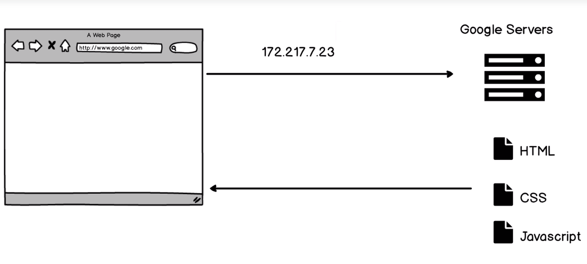

```{css, echo=FALSE}
.inputcode{
    background-color: #90EE90
    }
.outputcode{
    background-color: #B0C4DE
}
```

```{r, echo=FALSE}
knitr::opts_chunk$set(comment="",
                      message=FALSE,
                      class.source="inputcode",
                      class.output="outputcode", 
                      tidy=TRUE)

```

## Section 2: How the Internet works




## what is a program
* allocate memory
* parse and execute

## Chrome V8
* memory heap
* call stack
