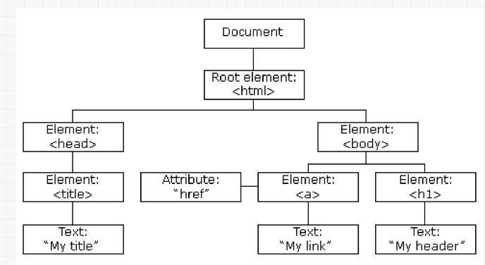

# Document Object Model



* change all the HTML elements in the page
* change all the HTML attributes in the page
* change all the CSS styles in the page
* remove existing HTML elements and attributes
* add new HTML elements and attributes
* JavaScript can react to all existing HTML events in the page
* JavaScript can create new HTML events in the page

## DOM Selector

```doc
document.getElementsByclassName()
document.getElementsBytagName()
document.getElementById()
document.querySelector()
document.querySelectorAll("li, h1")
document.getAtrribute()
document.querySelector().getAtrribute()
```

<!-- changing style -->

```doc
className //best
classList //best
classList.add
classList.remove
classList.toggle
insertHTML //DANGEROUS
parentElement
children
```

<!-- events: things like clicking, mouse entering or hovering over something-->